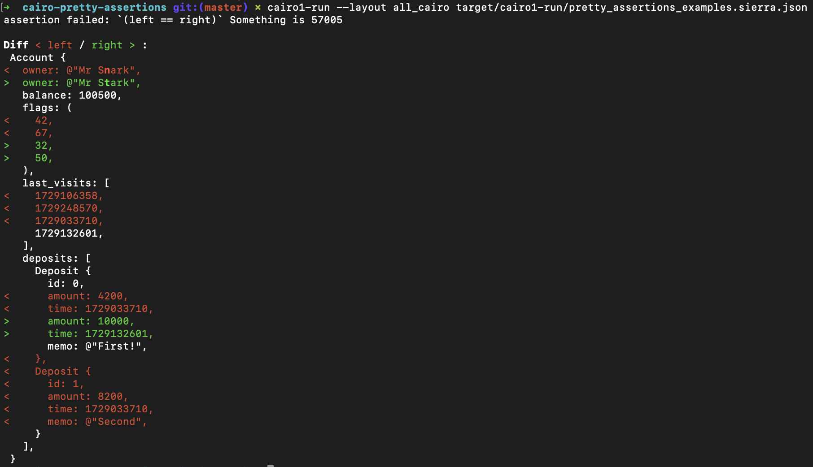

# Cairo Pretty Assertions

A port of the awesome [rust-pretty-assertions](https://github.com/rust-pretty-assertions/rust-pretty-assertions) crate to Cairo!

<p align="center" width="100%">
  
</p>

## Usage

> [!WARNING]  
> Colored diffs are currently not displayed neither by `cairo-lang-runner` (which is inside Scarb as well) nor `cairo1-run`.

There are pending PRs to enable ASCII escape sequences that would make the output readable.  
Until then you can test the package by isntalling `cairo1-run` from a branch:

```sh
cargo install --git https://github.com/m-kus/cairo-vm --rev b42c99c840d3816a9e3439345e9eaa46ba876ca3 cairo1-run
```

### Unit tests

This package provides a drop-in replacement for the `assert_eq!` macro, just add the following import to your `Scarb.toml` and it will  work automatically:

```toml
[dev-dependencies]
pretty_assertions = "0.1"
```

### Integration tests

You can use `assert_eq!` outside of tests as well! This is useful if you are using Cairo for writing programs outside of Starknet, and you need to run integration tests.

```toml
[dependencies]
pretty_assertions = "0.1"
```

There is also a slightly modified function which treats all `ByteArray` as bytes and prints them as hex strings:

```cairo
pretty_assertions::assert_eq(@lhs, @rhs);
```
